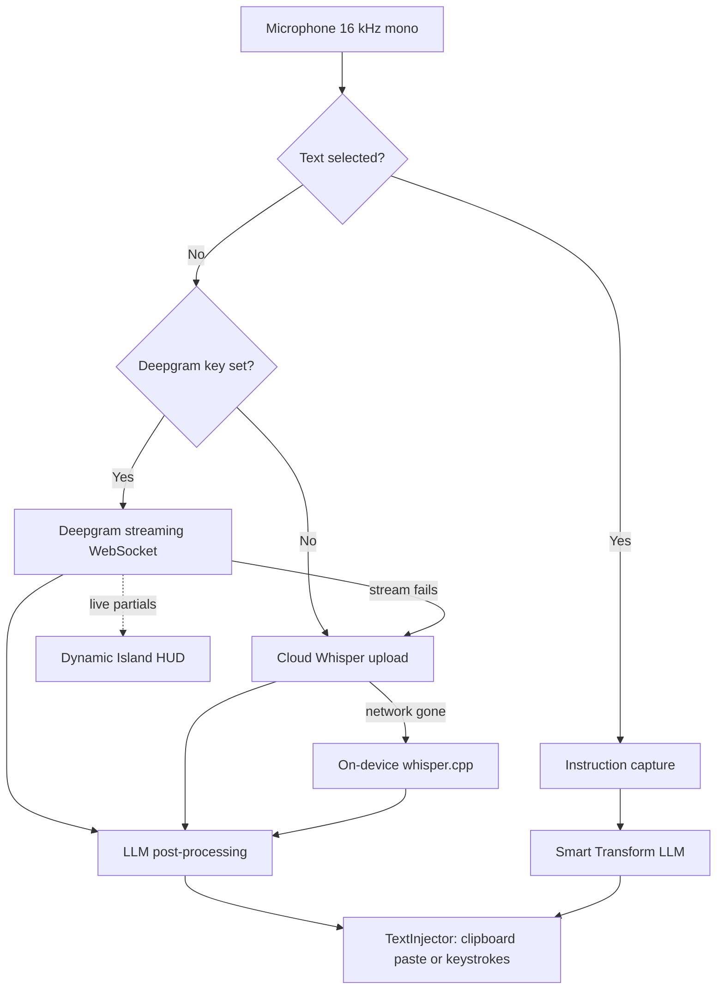

<p align="center">
  
  <h1 align="center">Lyra</h1>
  <p align="center">
    <strong>Streaming voice dictation and in-place voice editing for macOS.</strong><br>
    Live streaming transcription &bull; Dynamic Island HUD &bull; LLM post-processing &bull; Bring your own keys
  </p>
  <p align="center">
    <a href="#key-features">Key Features</a> &bull;
    <a href="#smart-voice-editing">Smart Voice Editing</a> &bull;
    <a href="#quick-start">Quick Start</a> &bull;
    <a href="#architecture">Architecture</a> &bull;
    <a href="#privacy--security">Privacy</a> &bull;
    <a href="#license">License</a>
  </p>
  <p align="center">
    
    
    
    
    
    
  </p>
</p>

---

## Overview

**Lyra** is a macOS dictation and voice-editing app that you point at your own API keys.

Speech is transcribed **while you are still speaking** over a streaming connection, so the words appear in a floating island as they leave your mouth and are ready the instant you release the key. An LLM then cleans up punctuation, filler words and self-corrections before the text lands at your cursor.

Hold a key. Speak. Release. Your polished thoughts appear at the cursor.

> **Two transcription tiers.** With a Deepgram key configured, audio is streamed live and that transcript is what gets inserted. Without one — or if the stream drops mid-sentence — Lyra falls back to uploading the recording to your configured Whisper provider, and to on-device `whisper.cpp` if the network is gone entirely.

---

## Key Features

- **Live Streaming Transcription**: With a Deepgram key, audio is streamed over a WebSocket as you speak and partial results arrive continuously — no waiting for an upload after you stop. The transcript is settled by the time you release the key.
- **Dynamic Island HUD**: A floating island that grows to fit your words as they arrive, with real-time fluid audio visualizers and live state badges. Follows the display your cursor is on, and stays where you drag it.
- **Smart Voice Editing (Selection Transform)**: Highlight text in *any* macOS app (Telegram, VS Code, Safari, Mail, Slack), press your hotkey, and speak a voice command (*"Translate to English"*, *"Make it concise and formal"*). Lyra replaces the selection with the refined result.
- **Natural Speech Cleanup**: Filler words (*"ну", "вот", "короче"*) are removed, and self-corrections are resolved (*"Let's meet on Tuesday... no wait, Wednesday at 5"* → *"Let's meet on Wednesday at 5."*). Your wording and style are preserved; only the speech artifacts go.
- **Vocabulary That Actually Reaches the Engines**: Your custom terms bias recognition *and* are given to the post-processor, so an unfamiliar product name is both more likely to be heard correctly and repaired if it is not.
- **Hotkey Combinations & Two Gestures**: Bind a bare modifier or a chord such as `fn + \``. Hold to talk, or tap to keep recording hands-free — both on one key, or split across a dedicated hands-free key. Bare modifiers are never swallowed, so `⌥ + ←` and friends keep working system-wide.
- **Layered Fallback**: Stream → cloud upload → on-device `whisper.cpp`. Local transcription uses the Metal GPU backend on Apple Silicon; on Intel Macs it runs on CPU and is several times slower than realtime, so treat it as a genuine last resort rather than a seamless one.
- **Non-Destructive Text Insertion**: Clipboard paste (`Cmd+V`) or synthesized keystrokes. The clipboard is snapshotted and restored, and back-to-back dictations cannot clobber what you had copied.
- **Secrets in the Keychain, Private Mode for History**: Every API key lives in the macOS Keychain. Dictation history is opt-out with one switch, and logs never contain your dictated text.
- **Pay-As-You-Go, Your Own Keys**: No subscription and no Lyra server. You pay your providers directly — Deepgram bills streamed audio per minute, the LLM bills tokens per dictation — typically a small fraction of a cent per dictation.

---

## Smart Voice Editing

Lyra is more than a speech-to-text dictation tool—it is an interactive voice editor:

```
┌────────────────────────────────────────────────────────┐
│ 1. Highlight text in any application (Browser, IDE...) │
│ 2. Hold hotkey (Option)                                │
│ 3. Speak instruction: "Make this concise and polite"   │
│ 4. Release key ──> Text is transformed in place!       │
└────────────────────────────────────────────────────────┘
```

Supported transformations out of the box:
- **Tone Shifts**: Formal, friendly, persuasive, concise.
- **Instant Translation**: Any language to any language on the fly.
- **Code & Syntax Correction**: Fix typos, rename identifiers, format markdown.
- **Direct Replacement**: Highlight an outdated paragraph and dictate the new version.

---

## Architecture



1. **Audio Capture**: `AVAudioEngine` captures and converts to 16 kHz mono Float32. An optional warm standby keeps the graph prepared so the first syllable is not clipped.
2. **Accessibility Inspection**: `SelectedTextReader` inspects the focused element off the main thread with an 80 ms timeout per call, so Smart Edit never delays the microphone.
3. **Speech-to-Text**: Deepgram streaming when configured, otherwise a batch upload to your OpenAI-compatible endpoint, otherwise `whisper.cpp` on device.
4. **LLM Polish**: Punctuation, casing, filler removal, self-correction repair and vocabulary normalization via the chat-completions endpoint you configure.
5. **Universal Injection**: `TextInjector` snapshots the pasteboard, posts `Cmd+V`, and restores the original contents once the target app has read it.

---

## Quick Start

### Prerequisites

- macOS 12.0 or later (Monterey, Ventura, Sonoma, Sequoia)
- Apple Silicon (M1/M2/M3/M4) or Intel Mac
- Xcode Command Line Tools (`xcode-select --install`)

### Building from Source

```bash
# 1. Clone repository
git clone --recurse-submodules https://github.com/hamidkazimov777-cmd/Lyra.git
cd Lyra

# 2. Build universal binary (arm64 + x86_64); builds whisper.cpp on first run
make app

# 3. Install to Applications
cp -R build/Lyra.app /Applications/
open /Applications/Lyra.app
```

Other targets:

```bash
make test        # 142 unit tests, no network access required
make dmg         # packaged disk image
make xcodeproj   # generate Lyra.xcodeproj (requires xcodegen)
```

---

## Configuration

Lyra lives in your macOS menu bar and in the floating island.

- **Hotkeys** (*Settings → Hotkeys*): default `Left Option`. Any key or combination works — hold the modifiers and press the key to record a chord such as `fn + \``. Choose *Hold or Tap* to get push-to-talk and hands-free on one key, and optionally bind a second key that always toggles hands-free.
- **Streaming transcription** (*Settings → Provider → Streaming Transcription*): paste a [Deepgram](https://deepgram.com) key to enable live transcription. Model defaults to `flux-general-multi`, which detects the spoken language itself. Leave empty to transcribe with the provider below instead.
- **Speech provider** (*Settings → Provider*): your OpenAI-compatible endpoint and key — used as the fallback when streaming is off or fails. Recommended STT model: `openai/whisper-large-v3-turbo`.
- **AI text provider** (*Settings → Provider → AI Text Provider*): the chat-completions endpoint for post-processing and Smart Voice Editing, configured separately from speech. Recommended: `google/gemini-3.5-flash-lite`.
- **Vocabulary** (*Settings → Dictation*): names and terms you use often. They bias recognition and are given to the post-processor.
- **System prompt** (*Settings → Dictation*): edit the post-processing rules directly, including how aggressively filler words are removed.

---

## Privacy & Security

Lyra ships in **Cloud / Custom API** mode by default, which means audio — and, with AI post-processing or Smart Voice Editing enabled, your text — is sent to the provider you configure. Read [SECURITY.md](SECURITY.md) for the full data-flow breakdown before deciding what to enable.

- **Live Streaming Is Opt-In**: With a Deepgram key set, your microphone is streamed to Deepgram continuously while you speak, and its transcript is what gets inserted. This is the most privacy-significant setting in the app — clear the key to disable it.
- **Direct Connections**: Cloud API calls go straight from your Mac to the Base URL you configured over TLS. There is no Lyra server and no intermediate proxy.
- **Keychain-Backed Secrets**: API keys — speech, AI and Deepgram — are stored in the macOS Keychain, not in preferences. The speech key is only ever sent to the AI endpoint if you opt in *and* both endpoints share a host.
- **Ephemeral Audio**: Audio buffers reside only in RAM during dictation and are discarded immediately. Audio is never written to disk.
- **Fully Offline Mode**: Select **Local Whisper** and disable the AI features for operation in which nothing leaves your Mac.
- **History Is On Disk**: Dictations are saved as unencrypted JSON under `~/Library/Application Support/Lyra/`. Turn this off with **Advanced → Private mode**.
- **Clipboard**: The default paste-based insertion snapshots, overwrites and restores your clipboard. Switch to "Simulate Keystrokes" to avoid it entirely.
- **Zero Telemetry**: No tracking, no user analytics, no crash reporting, no update pings.

---

## License

Lyra is open-source software licensed under the [MIT License](LICENSE).
