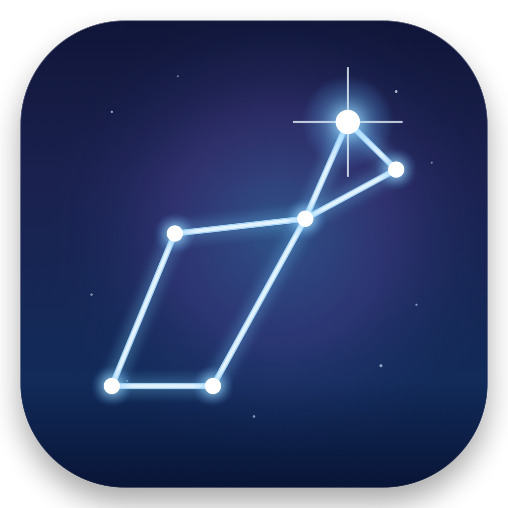
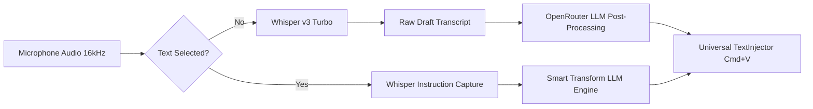

<p align="center">
  
  <h1 align="center">Lyra</h1>
  <p align="center">
    <strong>Next-generation voice dictation and intelligent text editing for macOS.</strong><br>
    Apple Intelligence aesthetics &bull; Whisper v3 Turbo &bull; Dynamic Island HUD &bull; OpenRouter AI
  </p>
  <p align="center">
    <a href="#key-features">Key Features</a> &bull;
    <a href="#smart-voice-editing">Smart Voice Editing</a> &bull;
    <a href="#quick-start">Quick Start</a> &bull;
    <a href="#architecture">Architecture</a> &bull;
    <a href="#privacy--security">Privacy</a> &bull;
    <a href="#license">License</a>
  </p>
  <p align="center">
    
    
    
    
    
  </p>
</p>

---

## Overview

**Lyra** is a premier, privacy-centric macOS application that transforms how you write and edit text across your Mac. 

Combining the blistering speed of **OpenAI Whisper Large v3 Turbo**, the contextual finesse of modern LLMs (**Gemini 3.5 Flash Lite**, **GPT-4o Mini**, **DeepSeek V3**), and an **Apple Intelligence-inspired Dynamic Island HUD**, Lyra delivers commercial-grade voice editing and dictation at fractions of a cent per day without monthly subscription lock-ins.

Hold a key. Speak. Release. Your polished thoughts appear at the cursor.

---

## Key Features

- 🏝️ **Dynamic Island HUD & Fluid Voice Waveforms**: Unobtrusive floating island that tucks under the MacBook camera notch (or centers on external displays). Features real-time fluid organic audio level visualizers, live state badges, and smart error recovery.
- ⚡ **Whisper Large v3 Turbo Pipeline**: Fast cloud speech-to-text with multi-language precision (Russian, English, and 90+ languages).
- ✨ **Smart Voice Editing (Selection Transform)**: Highlight text in *any* macOS app (Telegram, VS Code, Safari, Mail, Slack), press your hotkey, and speak a voice command (*"Translate to English"*, *"Make it concise and formal"*, *"Fix punctuation"*). Lyra replaces the selection with the refined result.
- 🗣️ **Natural Speech Self-Correction**: Made a mistake while talking? Just correct yourself (*"Let's meet on Tuesday... no wait, Wednesday at 5 PM"*). The LLM post-processing layer automatically eliminates abandoned thoughts and outputs only the final intended meaning (*"Let's meet on Wednesday at 5 PM."*).
- 🛡️ **Zero-Downtime Local Fallback**: If Wi-Fi drops, Lyra seamlessly switches to on-device **whisper.cpp** powered by Apple Metal GPU acceleration. Your workflow never stops.
- 📋 **Non-Destructive Universal Ingestion**: Text is inserted anywhere via synthesized keystrokes or clipboard paste (`Cmd+V`) with automatic background restoration of previous clipboard contents.
- 💰 **Pay-As-You-Go ($0.0006 / dictation)**: Connects directly to OpenRouter or OpenAI with your personal API key. $5 gives you over 8,000+ dictations—over 20x cheaper than monthly subscription apps ($10–$15/mo).
- ⌨️ **Push-to-Talk & Hands-Free Toggle Modes**: Hold and release for quick snippets, or tap to record extended thoughts hands-free.

---

## Smart Voice Editing

Lyra is more than a speech-to-text dictation tool—it is an interactive voice editor:

```
┌────────────────────────────────────────────────────────┐
│ 1. Highlight text in any application (Browser, IDE...) │
│ 2. Hold hotkey (Option)                                │
│ 3. Speak instruction: "Make this concise and polite"   │
│ 4. Release key ──> Text is transformed in place!       │
└────────────────────────────────────────────────────────┘
```

Supported transformations out of the box:
- **Tone Shifts**: Formal, friendly, persuasive, concise.
- **Instant Translation**: Any language to any language on the fly.
- **Code & Syntax Correction**: Fix typos, rename identifiers, format markdown.
- **Direct Replacement**: Highlight an outdated paragraph and dictate the new version.

---

## Architecture

Lyra is built with a resilient, multi-tiered pipeline:



1. **Audio Capture**: `AVAudioEngine` records and hardware-converts audio to 16 kHz 16-bit mono PCM.
2. **Accessibility Inspection**: `SelectedTextReader` safely inspects focused UI elements with an 80ms strict timeout to prevent thread freezes.
3. **Speech-to-Text**: Fast batch submission to OpenRouter / OpenAI Whisper endpoint.
4. **LLM Polish & Self-Correction**: Contextual refinement via Gemini 3.5 Flash Lite or custom selected models.
5. **Universal Injection**: `TextInjector` preserves user clipboard snapshot, posts `Cmd+V`, and restores original pasteboard items.

---

## Quick Start

### Prerequisites

- macOS 12.0 or later (Monterey, Ventura, Sonoma, Sequoia)
- Apple Silicon (M1/M2/M3/M4) or Intel Mac
- Xcode Command Line Tools (`xcode-select --install`)

### Building from Source

```bash
# 1. Clone repository
git clone --recurse-submodules https://github.com/hamidkazimov777-cmd/Lyra.git
cd Lyra

# 2. Build universal binary (arm64 + x86_64)
make app

# 3. Install to Applications
cp -R build/Lyra.app /Applications/
open /Applications/Lyra.app
```

---

## Configuration

Lyra lives in your macOS menu bar and Dynamic Island:

- **Hotkey**: Configure your preferred key in **Settings → Hotkeys** (Default: `Option`).
- **Provider & Models**: Enter your OpenRouter or OpenAI API key in **Settings → Speech**.
  - Recommended STT: `openai/whisper-large-v3-turbo`
  - Recommended Post-Processing: `google/gemini-3.5-flash-lite` (latency ~0.7s) or `openai/gpt-4o-mini`.
- **System Prompt**: Fine-tune your AI post-processing prompt directly from the settings panel.

---

## Privacy & Security

Lyra ships in **Cloud / Custom API** mode by default, which means audio — and, with AI post-processing or Smart Voice Editing enabled, your text — is sent to the provider you configure. Read [SECURITY.md](SECURITY.md) for the full data-flow breakdown before deciding what to enable.

- **Live Streaming Is Opt-In**: With a Deepgram key set, your microphone is streamed to Deepgram continuously while you speak, and its transcript is what gets inserted. This is the most privacy-significant setting in the app — clear the key to disable it.
- **Direct Connections**: Cloud API calls go straight from your Mac to the Base URL you configured over TLS. There is no Lyra server and no intermediate proxy.
- **Keychain-Backed Secrets**: API keys — speech, AI and Deepgram — are stored in the macOS Keychain, not in preferences. The speech key is only ever sent to the AI endpoint if you opt in *and* both endpoints share a host.
- **Ephemeral Audio**: Audio buffers reside only in RAM during dictation and are discarded immediately. Audio is never written to disk.
- **Fully Offline Mode**: Select **Local Whisper** and disable the AI features for operation in which nothing leaves your Mac.
- **History Is On Disk**: Dictations are saved as unencrypted JSON under `~/Library/Application Support/Lyra/`. Turn this off with **Advanced → Private mode**.
- **Clipboard**: The default paste-based insertion snapshots, overwrites and restores your clipboard. Switch to "Simulate Keystrokes" to avoid it entirely.
- **Zero Telemetry**: No tracking, no user analytics, no crash reporting, no update pings.

---

## License

Lyra is open-source software licensed under the [MIT License](LICENSE).
